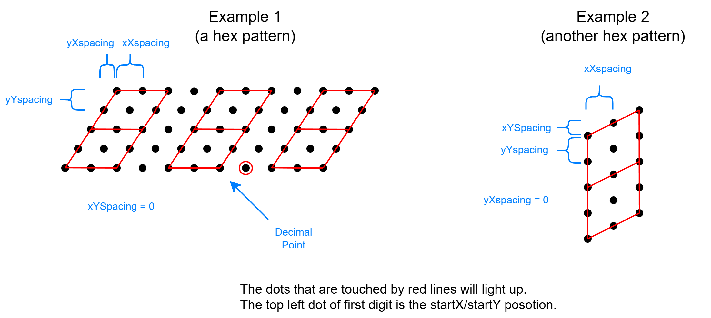

# Mesh Panel Temperature Display
## Overview
The Mesh Panel Temperature Display is a mini hardware display designed to show the current PC temperature through a mesh panel. It utilizes a small OLED screen to provide real-time temperature readings. The numbers are displayed with small dots through the mesh, creating a seven-segment like appearance.
The display is powered by a MCU with Arduino that reads the temperature data from the PC through a USB connection. A companion software on the PC retrieves the temperature data and sends it to the display.
## Features
- Real-time temperature display through a mesh panel, with 2 to 4 digit slots and an optional unit suffix (C/F)
- Configurable display "dots" to create a seven-segment like appearance. Can configure size and position of the dots to match any mesh panel pattern.
- Simple USB serial communication between the PC and the display
- Able to choose CPU/GPU or more temperature sources to display. Can also do a combined max of several temperature sources. (This is only on the PC software side, the display just receives a number to show)
## Details
### Dot Display Pattern
- The digit display has these parameters, they can determine the size and position of the dots to match the mesh panel pattern: (unit in pixels)
    - `startX`: The X coordinate of the top-left corner dot of the first digit
    - `startY`: The Y coordinate of the top-left corner dot of the first digit
    - `dotSize`: The diameter of each dot
    - `xXSpacing`: The x-offset to the next dot in the x direction
    - `xYSpacing`: The y-offset to the next dot in the x direction
    - `yXSpacing`: The x-offset to the next dot in the y direction
    - `yYSpacing`: The y-offset to the next dot in the y direction
    - `digitCount`: Number of digit slots to display. Valid values are 2, 3, or 4.
    - `unitSuffix`: Optional unit suffix shown after the last digit. Valid values are `C`, `F`, or blank.

- The position of the dots are illustrated in the diagram:

- The whole digit group and optional unit suffix is treated as one display unit. The `startX` and `startY` values define the top-left corner dot of the first digit, and the spacing parameters determine the position of all dots for the configured digit count.
- For `digitCount = 2`, the display shows two whole digits with no decimal point.
- For `digitCount = 3`, the display shows either `xx.x` or `xxx` depending on the value.
- For `digitCount = 4`, the display shows either `xxx.x` or `xxxx` depending on the value.

### Extra Parameters
- `refreshInterval`: The time interval (in milliseconds) for refreshing the display with new temperature data
- `invertDisplay`: A boolean flag to determine whether to invert the display colors (white on black or black on white)
- `digitCount`: Choose how many digit slots to display on the OLED. This is now configurable through the serial protocol.
- `unitSuffix`: Optional `C`, `F`, or blank suffix shown next to the last digit. This is now configurable through the serial protocol.
- `invertDisplay`: Choose whether the OLED background is black (`0`) or white (`1`). This is now configurable through the serial protocol.
- Note: the display receives configuration values and temperature updates from the PC software.
### Communication Protocol
- **Transport**: UART Serial at 9600 baud (native USB on Arduino Micro)
- **Format**: Text-based commands with format `COMMAND:VALUE\n`
- **Reliability**: ACK handshake mechanism ensures no commands are lost during rapid sequences
  - MCU sends `ACK:OK\n` after successfully parsing a command
  - MCU sends `ACK:ERROR\n` if command format is invalid or parsing fails
  - PC should wait for ACK response before sending the next command

**Implemented Commands:**
- `TEMP:XXX` - Set temperature display value in tenths of degrees
  - Example: `TEMP:339\n` displays 33.9 degrees
  - MCU responds: `ACK:OK\n`
- `DOTDIAMETER:X` - Set the dot diameter in pixels
- `STARTX:X` - Set the X coordinate of the first digit
- `STARTY:X` - Set the Y coordinate of the first digit
- `XXSPACING:X.X` - Set horizontal dot spacing within a digit
- `XYSPACING:X.X` - Set vertical dot spacing within a digit
- `YXSPACING:X.X` - Set horizontal row spacing within a digit
- `YYSPACING:X.X` - Set vertical row spacing within a digit
- `DIGITCOUNT:N` - Set the digit count to 2, 3, or 4
- `SUFFIX:C|F|` - Set the suffix to `C`, `F`, or blank
- `INVERT:0|1` - Set the display to normal or inverted colors

**MCU Responses:**
- `ACK:OK\n` - Command processed successfully; PC may send next command
- `ACK:ERROR\n` - Command parsing failed; PC should retry or log error
- Status messages (e.g., "Temperature display initialized...")
- Debug messages (prefixed with `[DEBUG]`) when enabled

**Parameter Storage:**
- Configuration parameters (dotSize, spacing, digitCount, unitSuffix, invertDisplay) are not persisted in MCU flash
- PC software must send all parameters after each power-up or MCU reset
- Temperature updates can occur any time; MCU maintains live mode once first TEMP command received
### Hardware
- MCU: Arduino Micro (ATmega32u4)
- Display: 128x64 OLED (SH1106 via I2C)
- Power: USB powered from the PC
- One LED for debugging and status indication
- One rst button to reset the MCU
- Uses native USB of the ATmega32u4 for communication and power, no additional USB to serial converter needed
- Has magnets on the PCB to attach to the mesh panel